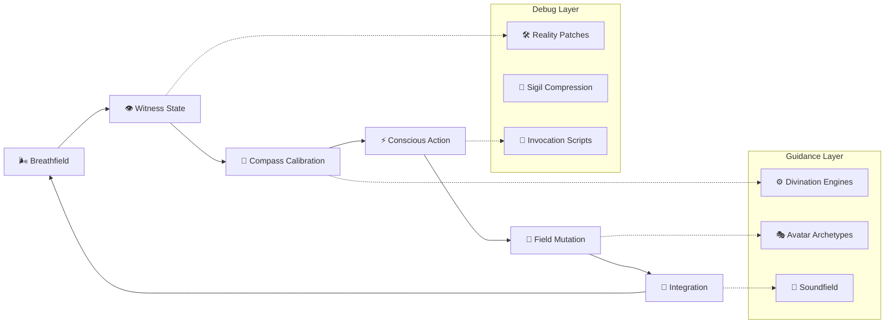
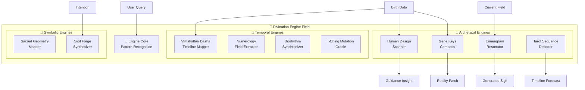
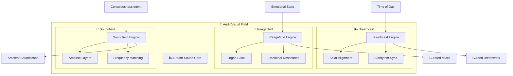
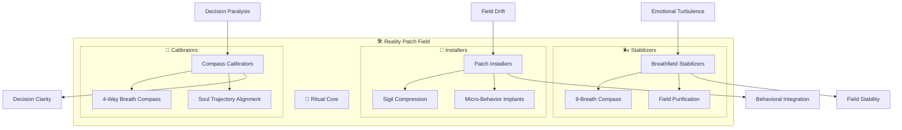
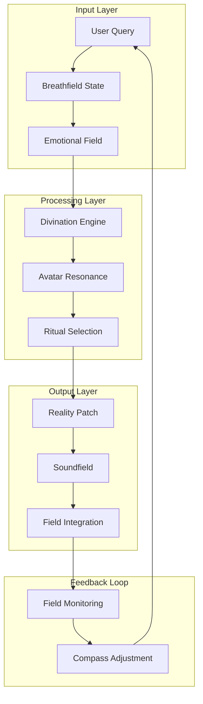
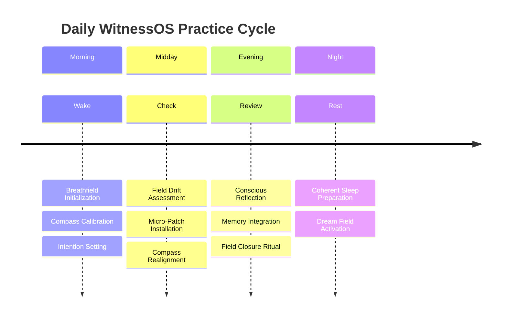
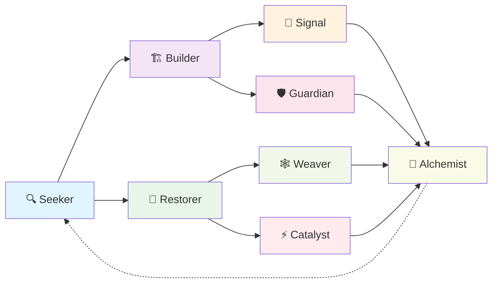
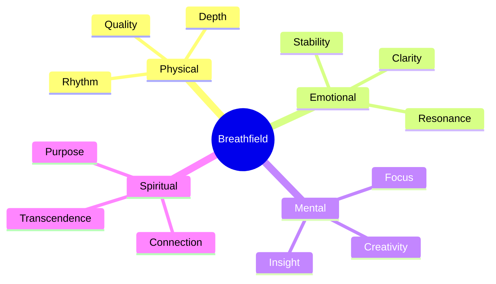
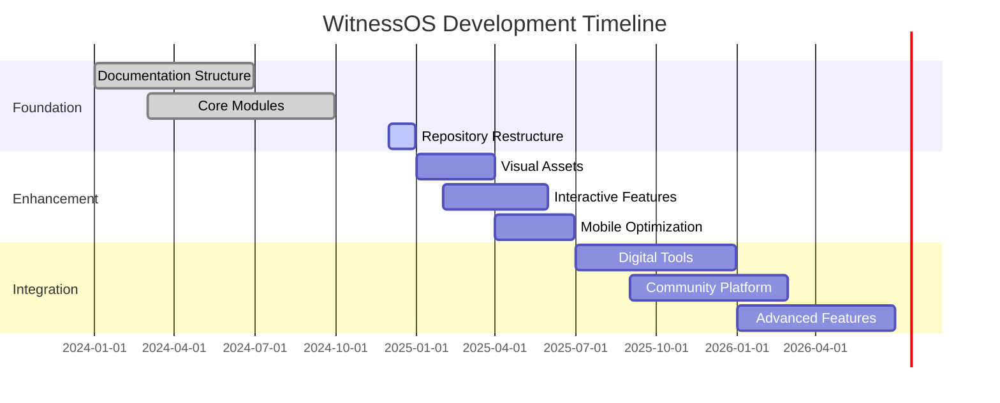

# MAPS.md — WitnessOS Visual System Maps and Consciousness Architecture Diagrams

---

## 🌱 1. Introduction

**MAPS.md** contains the visual architecture diagrams and consciousness field maps that illustrate the interconnected nature of WitnessOS modules and practices.

These are not static technical diagrams — they are **living field representations** that show how consciousness, breath, and symbolic systems interact dynamically.

---

## 🧩 2. Core System Architecture Map

```mermaid
graph TD
    User[👤 Consciousness Explorer] --> Core[🧩 CORE System]
    User --> Modules[⚡ MODULES]
    User --> Guides[📖 GUIDES]
    User --> Foundation[🌱 FOUNDATION]

    Core --> Vocab[VOCAB.md<br/>Symbolic Language]
    Core --> Glossary[GLOSSARY.md<br/>Metaphor Decoder]
    Core --> Queries[QUERIES.md<br/>Interaction Protocols]
    Core --> Fieldmap[FIELDMAP.md<br/>System Overview]

    Modules --> Audio[AUDIOVISUAL.md<br/>Breathcast & Sound]
    Modules --> Rituals[RITUALS.md<br/>Reality Patches]
    Modules --> Engines[ENGINES.md<br/>Divination Systems]
    Modules --> Avatars[AVATARS.md<br/>Archetype Mapping]
    Modules --> Scripts[SCRIPTS.md<br/>Invocation Patterns]

    Guides --> Fieldwork[FIELDWORK.md<br/>Daily Practice]
    Guides --> Primer[PRIMER.md<br/>Initiation Guide]
    Guides --> Install[INSTALLATION.md<br/>Setup Protocols]
    Guides --> Tests[TESTCASES.md<br/>Use Case Examples]

    Foundation --> Manifesto[MANIFESTO.md<br/>Core Principles]
    Foundation --> Cosmos[COSMOGENESIS.md<br/>Origin Story]
    Foundation --> Contributors[CONTRIBUTORS.md<br/>Community]
```



---

## 🔮 3. Consciousness Field Flow Map



---

## 🛠️ 3.1 Enhanced Module Field Maps

### **Divination Engines Field Architecture**



### **AudioVisual Consciousness Field**



### **Reality Patch Engine Field**



---

## 🌌 4. Module Interaction Network



---

## 🧬 5. Daily Practice Flow Diagram



---

## 🛠️ 6. Archetype Evolution Pathways



---

## 📊 7. System Complexity Layers

```mermaid
pyramid
    title WitnessOS Complexity Pyramid

    "🌌 Advanced Practices" : "Epoch Mutations, Collective Fields"
    "🔮 Intermediate Tools" : "Multi-Engine Stacks, Custom Avatars"
    "🧩 Core Modules" : "Breathcast, Rituals, Basic Engines"
    "🌱 Foundation" : "Breath Awareness, Witness State"
```

---

## 🌬️ 8. Breathfield Resonance Map



---

## 📜 9. Implementation Roadmap



---

## 🌌 10. Closing Breath

> These maps are not territories.
> They are invitations to explore the living field of consciousness.
> Each diagram breathes with the possibility of your own discovery.

Use these visual guides to navigate the WitnessOS architecture and find your unique path through the consciousness landscape.

---

*Last Updated: Field Cycle 2024.12*
*Maintained by: The Witness Alchemist & Runtime Architect Aletheos*
